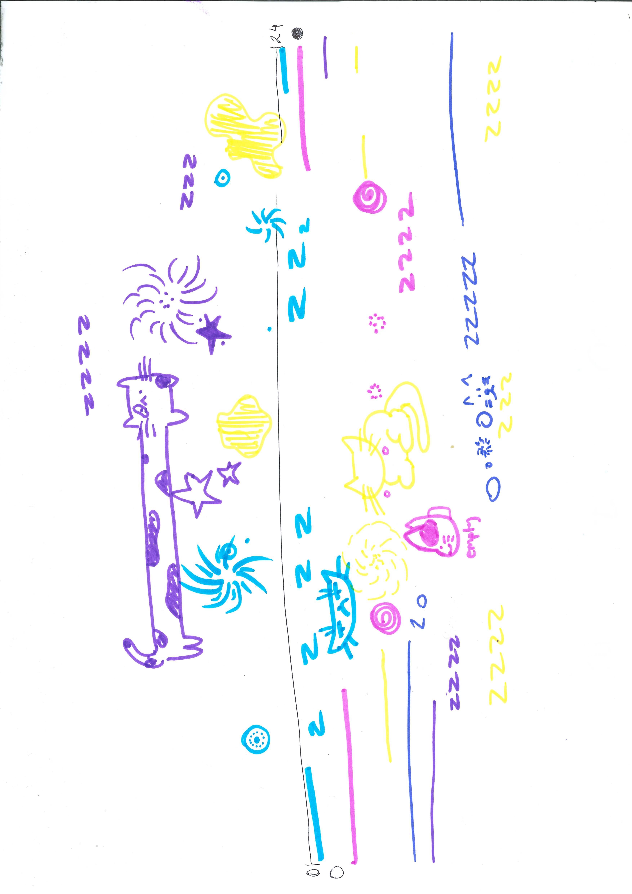

[← Back to Home](../index.md)

# Week 01 - Introduction

As the first week of the course, we were introduced and explained the purpose of this course and given an outline of what will happen the following weeks. 

What I have gathered is that the course will go over data in its many forms and how it can be interpreted, such as data visualisations, data as creative materials, data humanisms and data drawings.

An interesting example this week was how John Snow's work of visualising the data between Cholera and relevant waterways was able to assisst in mitigating the disease. This example helped highlight the importance of knowing how to design with data, as well as knowing how to interpret and visualise it.

By the end of the course, we will be expected to demonstrate critical understanding of theories and practices concerned with data representation.

## Data Portraits

We began our course with the group data portrait activity, in which we collected anonymous data with indivudual questions. After, we visualised it in a method unique to ours by inventing our own visual language. We then swapped our data drawing with another group, and saw how much of it we could decode.

*Questions and data that we gathered.*

*Our unique data visualised as a portrait.*

*The key to the data poritrait*

From the group we swapped with, we were able to decipher three things; method of transportation to university, distance from the university, and in which direction someone lived from the univeristy.

## Summary of my Thoughts

Overall, the first week's class was a great way to ease back into learning after a long holiday. The data aspect of this course actually seems a little tricky (due to my being as a professional procrastinator) to keep up with so I pray that I can "lock in" and not fall behind.

