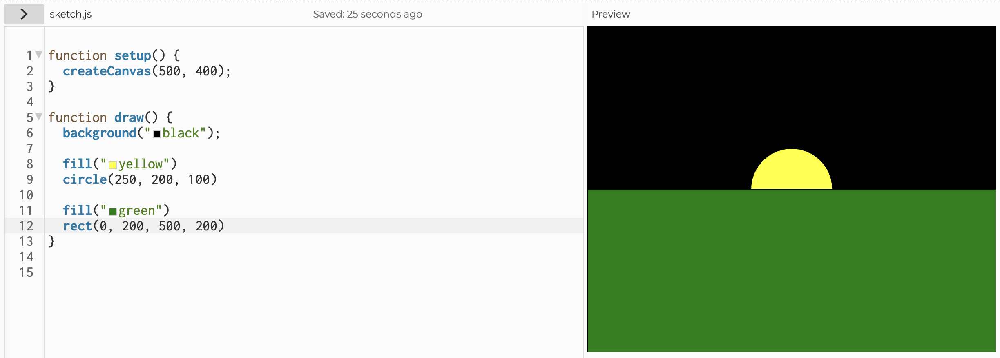
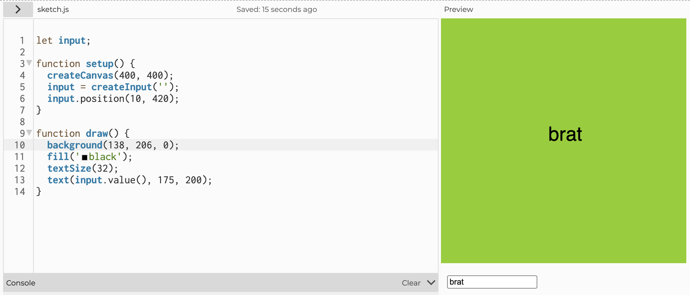

[← Back to Home](../index.md)
# Week 02 - p5.js

This week, we went into learning about the p5.js fundamentals of learning how to draw with script. The lecturers also help us set up this very website in order to document our learnings and progress for this class.

## The Data Drawings That I Definitely Did

I didn't do the data drawings I was supposed to do since last week. I am a liar and a fraud. 

The data I was originally keeping track of was "how many times i open a video game during a lecture", but it was a bit boring and I wanted to come up with something cooler. 

So in the end, I ended up keeping track of the amount of elo (points) I win or lose while playing a video game. by documenting the time spent, weapon used, and how many points I win/lose, I am hoping to sleuth out two things:

1. What weapons am I most likely to win on?
2. When do I start "tilting" (getting mad at the game and start doing worse)?

I'll have it figured out later. I most definitely will not regret that decision.

## Learning p5.js

First impressions of p5.js: this is awesome. I heard there was going to be a lot of scripting for this class but I kind of forgot because there was a bunch of manual drawing last week. 

Turns out the reason is because the years prior to this actually did have a bunch of scripting (hence me hearing word of the scripting aspect of this class) but got changed to be optional this year. Makes sense.

We went over the more simpler aspects of  script, learning the interface and certain functions to draw with simple shapes. This came very naturally to me, as someone who has worked with code a little bit. 

Scripting is easy once you realise you can just... rip other people's script off the internet, then "Franken-code" it to make it work. Besides that, p5.js comes with a documentation website (as any good scripting language should have). In conclusion, I think the scripting aspect of this class should be more than managable.

I love doing things that I'm already good at, which means that I will be taking back my opinion from last week of "this class is scary" to "this class is awesome".

With the basic tools we learnt, we were tasked to do an experiment drawing of replicating what was on the board. I think mine was as efficient as it gets:

*Super Optimised, I think.*

We also went through some other fundamentals such as variables, conditionals, and DOM elemtents. 

I already knew quite a bit of this; scripting really is just glorified maths. I recreated CharliXCX's hit album "brat" on the website.

*Honestly, I hate this album. But this is admittedly pretty funny.*

## The Making Journal

I think that, going forward, I will try to be a bit more personal with this journal. It'll probably help me a lot with motivating myself to write and finding more to write about. 

_JUNE FROM THE FUTURE (Week 4): I originally had the entire journal in lowercase letters because that's how I like to type_

_However, the rubric for the journal's presentation looked mighty scary, hence why I will be, infact, using proper grammar. Sigh._

## Summary of my Thoughts

The p5.js website is awesome. I think this may genuinely be my saving grace for this class. Hopefully I am able to retain some information about this website and utilise it for whatever final assignment I've got to hand in.

