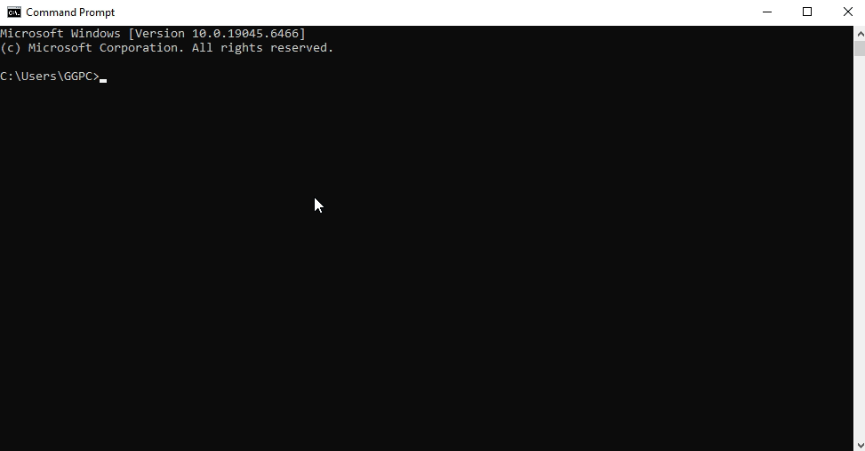
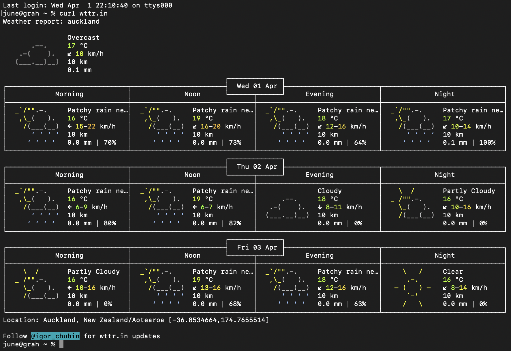
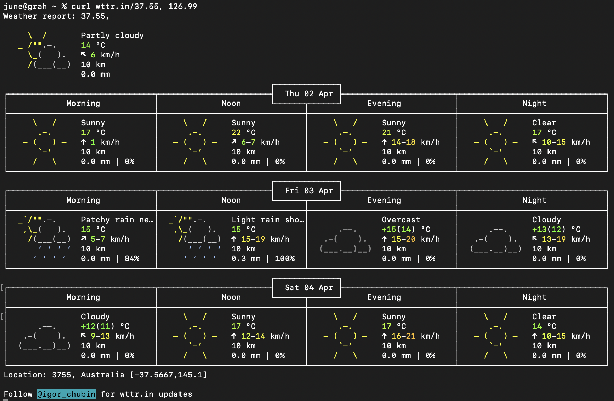
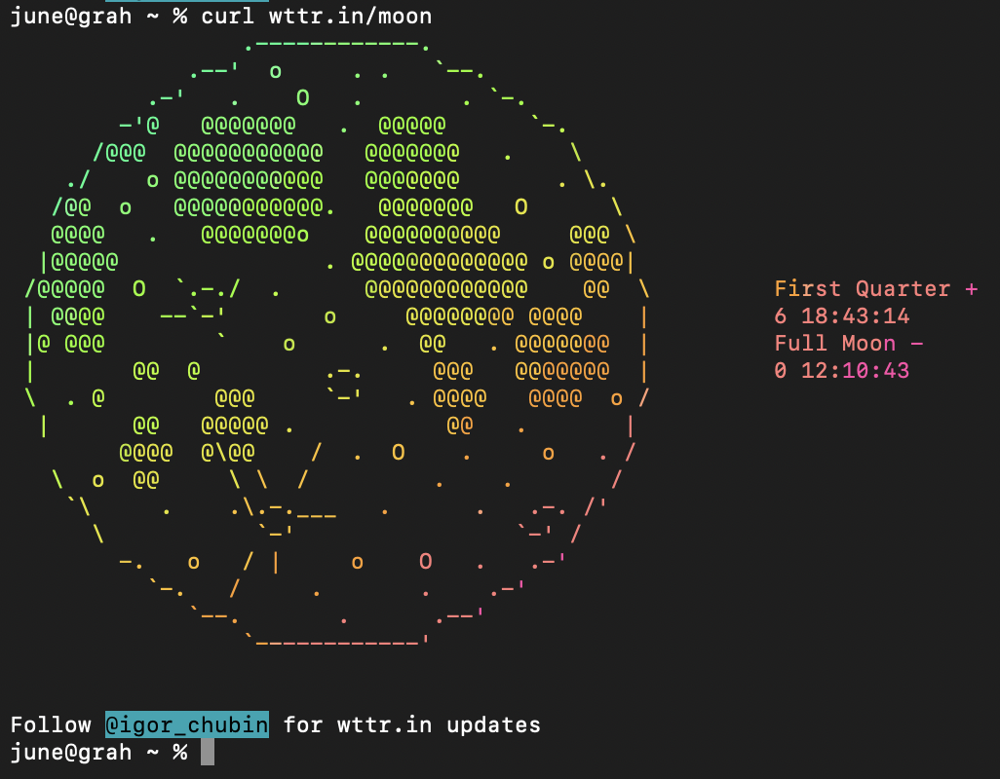
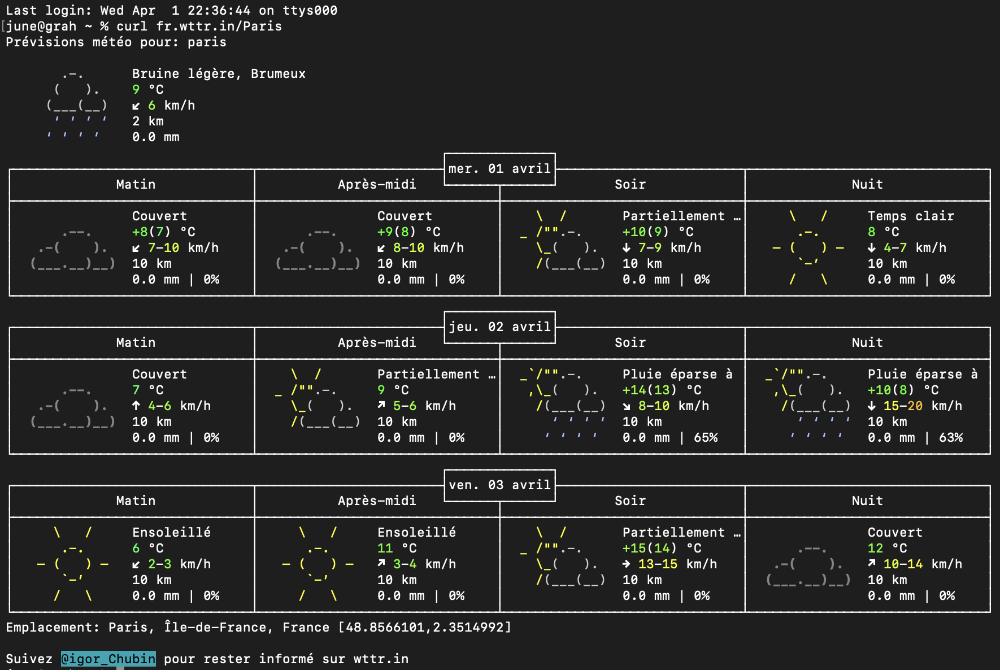
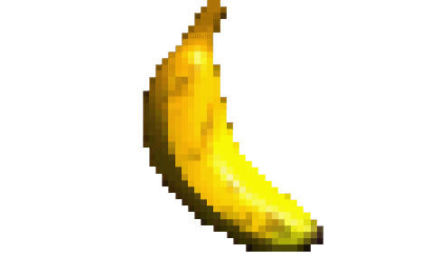

[← Back to Home](../index.md)
# Week 03 - I Can't Do Anything

This week covered more about the journal and how to set it up. This includes actually uploading it onto the website and adding images to our journal. We also learned about live data, and utilising the terminal in order to gather info and test out some other miscellaneous stuff. 

Most of it was learning the cURL features that come preinstalled in macOS and Windows. 

## cURL This and Thats

Our first experiment was copy and pasting in a code which demonstrates ASCII animations. This parrot is awesome, by the way.


*I did this on my PC at home so I could make it a gif. Gifs are awesome.*

The second experiment lets us see the weather in various places utilising wttr.in, a console-oriented weather forecast service. 


*New Zealand weather is unequivocally terrible.*

We also explored the possibilities of what wttr.in can do and did a few activities regarding them. This is especially easy thanks to the documentation (once again) provided for the service.


*I was trying to insert the coordinates of Korea, but something went wrong because I never wrote the negative for the latitude value. So anyways, here's Australia, I guess.*


*Moon phases. Yay.*


*Voici la météo à Paris. I studied four years of French for nothing.*

## I Lied, I Did Something

I am planning to push this website a bit beyond what is expected. By "push the website a bit beyond" I mean just adding silly images. I still think it's a little bit impressive, though. 

For example, I made my own custom folder called "misc" under the assets folder for the index page of this website. There I slapped in a bunch of miscellaneous gifs and photos I thought were pretty funny. Most of it are just spinning bananas, I wont lie.

The so-called "impressive" part is using the almighty "Google Dot Com" to search up how the media directory(?) format works on GitHub.

As the assets folder is on the same hierarchy(?) as the index page, instead of adding ".." to indicate the parent folder, you just do "." as that looks for a folder on the same hierarchy.

The script to add the sleeping little creature on my index page had me write the following:

 ````

 instead of the following:

  ````


*Wow, a spinning banana! I couldn't ask for more. This doesn't really exemplify my learnings since this isn't on the index, but you probably get the point.*

## The Weather Visualisation Experiment

We also practised using p5.js in order to display information from APIs.


*My changes to the original exemplary script.* 

The "wind" value is times by 20 in order to dictate the length of the red rectangle, and the "humidity" value determines the red value of the RGB background. The console also shows you directly the values of the temperature, wind speed, and humidity in that order, thanks to the built-in print function.

Note that, for the exemplary code, the white circle had constants instead of variables. This meant that no matter the coordinate changes, the radius stayed the same. However, I changed the script in order to make the circle's radius change based off of the temperature value multiplied by 24.5.

I also integrated another variable from the original API in order to include the time as well. I've set my code to use the "timeplace" variable as the input for the text function which is located at the center (200, 200) of the canvas (400, 400). I could not set the variable as "time" as time was a pre-existing function in the p5.js language.

Lastly, I used the random function in order to make the green value of the RBG background completely random. I set the variable "RNG" to be equal to a random value between 0 to 255.

Below this paragraph is a link to the p5.js file directly. Before you open, however, this is a friendly reminder that the background of the project flashes to a random colour every tick as mentioned in the paragraph above.

<details>
<summary>Click here to view "weather seizure" by hyun950 (me). </summary>

<iframe src="https://editor.p5js.org/hyun950/full/Udkl-0sKL" width="400" height="400"></iframe>

</details>

## The Data Drawings That I Most Definitely Did

I am most definitely going to regret pushing this so far into the week.

I do have an idea for my sketch, though; I want to add bubbles or shapes per session of me playing my video game. Depending on whether I go net positive or negative, the bubble will be a different colour. Inside the bubble is also the weapon I use. I also want to incorporate the time at which I play the video game to see whether that is relevant towards my win-to-lose ratio.