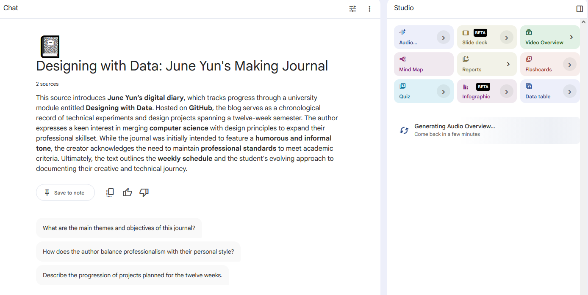
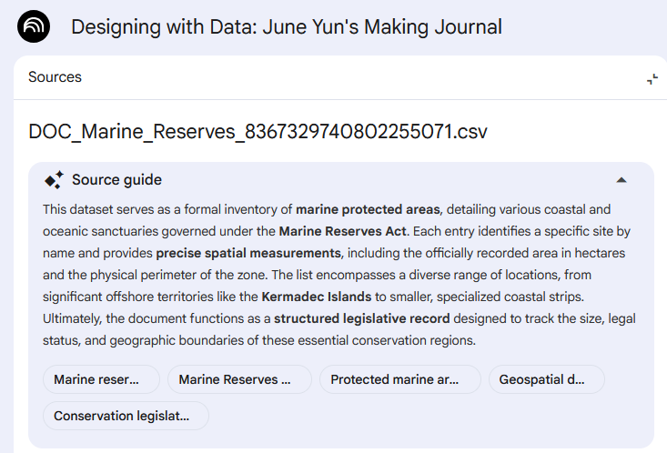

[← Back to Home](../index.md)
# Week 04 - The Age Old AI Debate. Also, I Can't Do Anything.

"How might AI change design?" "How do you use AI?" "What are your concerns about AI?"

Honestly, I don't use AI much at all. I don't even recall the last time I used AI. I do remember a few years ago I tried to get AI to draw me a picture of a full wine glass. It couldn't do that, by the way.

Aside from the whole environmental argument for people being against AI (the whole ruining the environment, polluting drinking water, stealing from others for data/plagarism, etc.), I think AI is still a pretty controversial tool; it is just far too easy to use as a tool for anti-intellectualism, and it shows just by touring the online spaces in this current era. Just go on Instagram or Tiktok. 

The only time I think AI should really be used is if it's entirely undetectable in whatever final product being produced. And by that, I don't mean like "the AI is so good at writing essays that it can go undetected by Turnitin", but rather something like, if someone asked you a question about any facet of your product, you should be able to explain it without mentioning AI at all. If AI gives you ideas or sources, then you should add upon that in order to make that idea or source your own.

Just in general, my biggest concern is AI and its other KillNature-O-Matic 2000's counterparts are being churned out like slop by the top 1%. At the end of the day, the real villains are greedy capitalist CEOs and billionaires. It really sucks knowing that AI could be used for good and also ethically, but it isn't because billionaires don't want to depart with their world hunger-ending sum of cash. Long live socialism. Yes, everything is political.

## Ollama (Start of I Can't Do Anything Arc)

"Ollama is a free, open-source tool that lets you run AI models on your own computer." 

I couldn't really do the in-class activity because my macOS was only version 13.2.1 Ventura. Ollama requires 14 Sonoma or higher.

I had to go home and use my dinky little computer with little to no storage left to do this activity. I fear my PC will explode.

## NotebookLM

I genuinely cannot do anything on my laptop I guess? For some reason, NotebookLM really doesn't want to open on my laptop. I had to do this at home, too.

*Here's proof that I did the stuff. I know the voiceover isn't ready yet but just trust me that it works because I already turned off my PC and do not want to have to take another screenshot.*

The audio overview option for NotebookLM is genuinely terrifying. Mimicking two people doing a podcast with my two inputs with proper pauses, jokes, and chuckling is genuinely terrifying. It's also giving me second hand embarrassment of my journal because the AIs are making me out to sound like a cornball. Maybe I ought to change it.

It's pretty jarring how much the overviews can churn out a well written paragraph about pretty much anything you feed into it. Also makes me think the importance of not falling for the trap of being lazy and not double checking that the information is all correct.

*I can really only assume the stuff here is accurate..*

## Datasets and Letting AI Do the Work Because I'm Lazy

