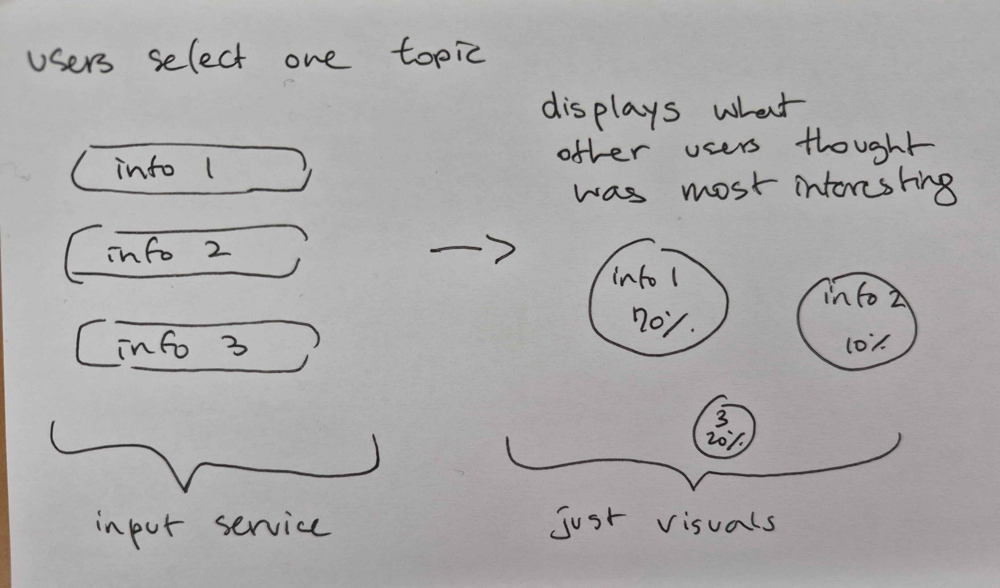
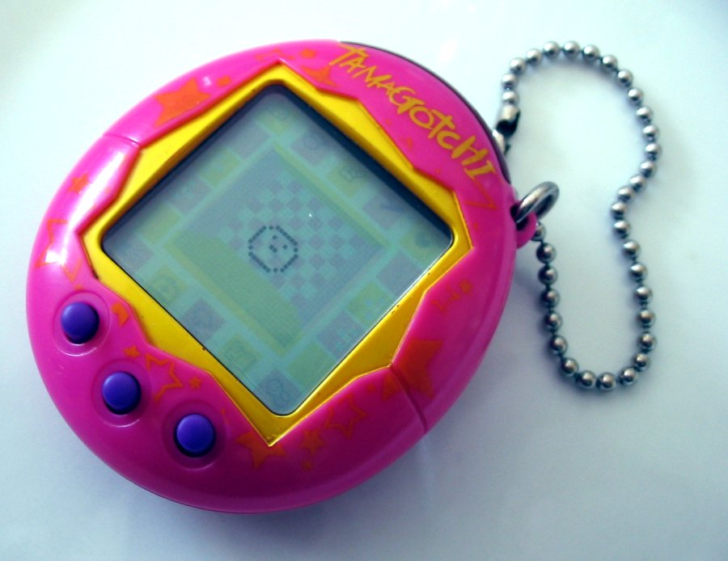

[← Back to Home](../index.md)
# Week 06 - I Waited 30 Minutes on the Phone for StudyLink to Pick Up

## Data Exploration

In terms of datasets that I would require for my project, there would be two types of data. For the first (and most important) set of data, I would require live data that has all the information relating to the options that users are able to select every day. This would be data such as weather, gas prices, grocery prices, traffic, etc., and the data would be sourced from public APIs. My second set of data would be the user inputs, so how many users chose a specific topic to be the most interesting to them on that day. This data will be collected live with people voting on the day. 

*Quick sketch of how the data would be collected and shown.*

Both of these types of data aren't quite preexisting, and so I would need to collect/simulate them. In terms of showing the data, I thought it'd be cool if I could somehow visually represent what information was chosen the most and what wasn't chosen as much. For example, perhaps the bubble that they the percentages are encased in are bigger or smaller depending on how popular they are.

My only concern so far is that the collected data might be slow, and the impact of being able to see the large collective of votes will be lost.

## Visual Research and Precedent Study 

*[The Tamagochi](https://en.wikipedia.org/wiki/Tamagotchi)*

For each reference, write a short response in your journal (1–2 sentences per point) addressing:

What draws you to it?
What specific quality or approach might you carry forward into your own work?
Does the encounter with this reference change or reinforce your current direction?

https://figure.nz/chart/lSYJzICrinllOY7p 

## Project Planning and Skills Roadmap 

3.1 What do I need to make?

For my project, I have to make two components for my work. Firstly, I have to create some sort of "shell" or visual that stores and displays my work nicely. Secondly, I need to make some sort of of digital painting that is able to house my APIs and present them in a way that is able to visually communicate their order of importance. This will probably be done in p5.js. 

3.2 What do I need to learn?

I will need to figure out what the "shell" is. I've had suggestions of making some sort of tamagochi inspired device, but I have no idea how to get around to that. It may be too big for my scope to realise, so I will have to backburner the idea for now.

3.3 What are my next steps?

Write a short (150–200 words) plan outlining what you need to do next to move your project forward. This should connect directly to your plans for making, your skills gaps, and data source(s).

## Independent Study

1. Consultation Reflection

Write a short paragraph (150–200 words) reflecting on your discussion in the Proposal Consultation. Consider: what questions or feedback came up that you found useful? Did the conversation shift or sharpen your project direction in any way? What will you do differently, or more deliberately, as a result?

2. Technical Skill Building

Using the skills roadmap produced in class, address your first priority technical gap. Document your learning process, including both textual and visual evidence, and include reflections on what you tried, what you learnt, and how this has helped you progress with your project development (e.g. by building skills to take on the next step, or by revealing that you need to pivot because something isn't working).

3. Initial Concept Sketch

Building on the drawing/diagram produced in class, make a more developed sketch, a rough digital prototype, a physical mock-up, or a short code experiment to visualise something — however provisional it might be — from your chosen dataset. Bring your sketch along to class next week.

