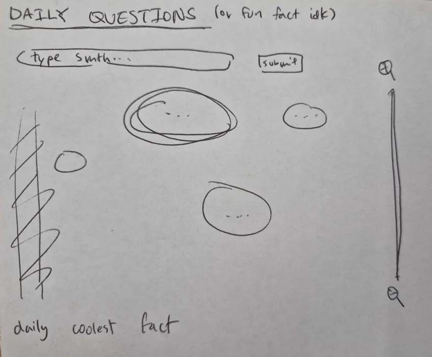
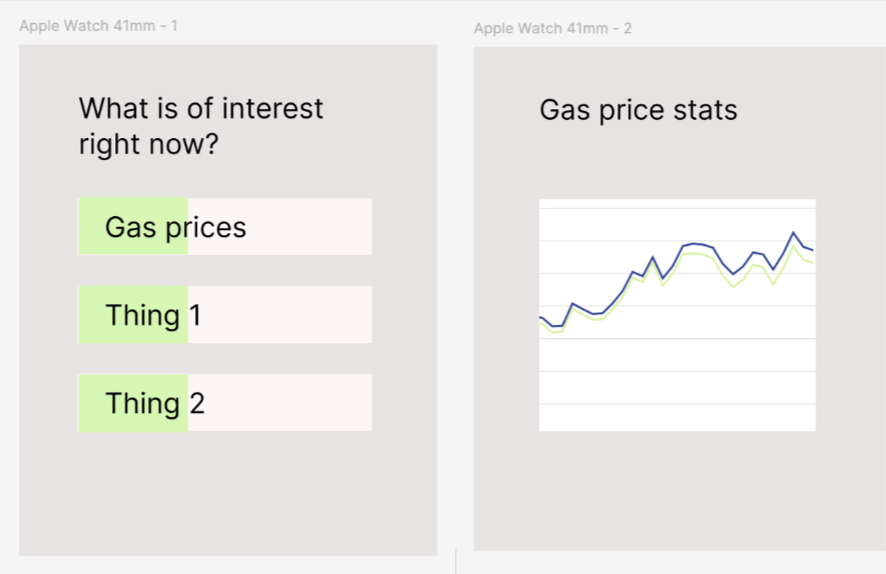

[← Back to Home](../index.md)
# Week 07 - Developing My Concept

## Concept Sketch

I want to make some sort of data visualisation that lets people see the most contemporary/relevant information that could aid them.

*0/10 sketch.*

I think my idea could be fun by using an interactive voting system in order to engage the viewers. The visualisation aspect is pretty barebones at the moment, but I think the system of having some personal input can be pretty interesting.

For example, people can vote onto one small fact as the most "interesting" or "useful" or even input something in themselves. How people determine what is relevant would purely be up to data.

## Making Sprint

For my making sprint, I tried to visualise what my project could look like. I used Figma and an Apple Watch template in order to simulate the small handheld device. I was trying to make it so that the prototype feature of being able to click buttons would work, but later I found out that I wasn't on the prototype version but the sketch version.

## Progress Report

Currently, I'm trying to figure out if it is possible to have embeds or iframes implemented onto my Figma prototypes. This way, I can include my live data into my final hand in which simulates how the app would work. 

Apparently, iframes are not available on the design boards of Figma, however, on the website boards, embeds are available. I may utilise that instead to demonstrate my project.
