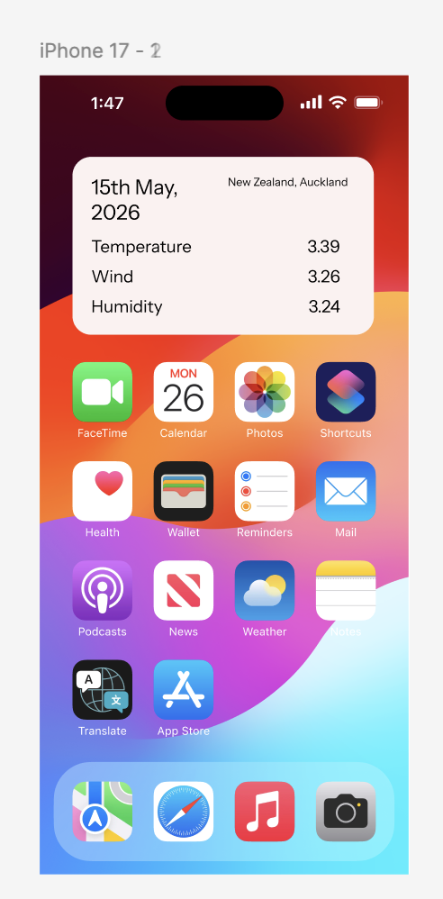

# Week 08

[← Back to Home](../index.md)

## Crit Presentation

  <iframe loading="lazy" style="position: absolute; width: 100%; height: 100%; top: 0; left: 0; border: none; padding: 0;margin: 0;"
    src="https://www.canva.com/design/DAHI820AZpU/gxSSNt5m9t92oE84VdJKmg/view?embed" allowfullscreen="allowfullscreen" allow="fullscreen">
  </iframe>

<a href="https:&#x2F;&#x2F;www.canva.com&#x2F;design&#x2F;DAHI820AZpU&#x2F;gxSSNt5m9t92oE84VdJKmg&#x2F;view?utm_content=DAHI820AZpU&amp;utm_campaign=designshare&amp;utm_medium=embeds&amp;utm_source=link" target="_blank" rel="noopener">WK7 PROGRESS REPORT</a> by June Yun

I didn't really get much criticism for my presentation, aside from people asking if it's feasible to even do a small apple watch style app. 

It'll probably be quite difficult, so I might just pivot to something easier and straight forward, like a widget.

It probably would've been nicer if the people at my desk were more engaged with the in-class task, but it is what it is. Regardless, I already have a lot of my ideas sorted out.

## Progress Report

This is just a simple mockup of what I want my project to look like. Currently there are no features but it does illustrate what the final hand-in might look like at the end.