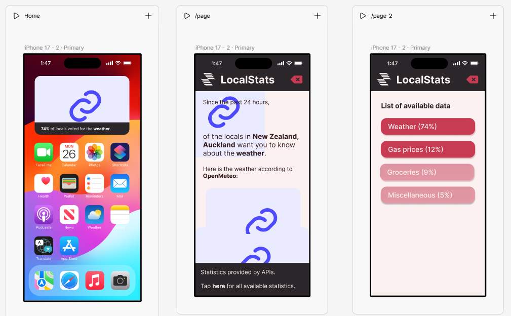

[← Back to Home](../index.md)
# Week 10 - If the Code Ain't Broke, Don't Touch It

## Progress Report

Here's me recreating the little widget prototype sketch from week 8.

<iframe src="https://editor.p5js.org/hyun950/full/rKj3PcT_U" width="350" height="250"></iframe>

To make it look a little bit more interesting, I coded some bubbles in the background that float around randomly within the range and domain of the canvas size.

*Ignore how it is off-center. It's on purpose so I can hide the scroll bars when I embed it to Figma Sites.*

Heres my current work on the exterior of the project.


*I've gotten the frames to look nicer. Ignore all the purple boxes; those are embeds.*

A neat thing I figured out how to do (that was completely unnecessary) is adding a gentle bobbing/floating aspect to my scripts. This was done by utilising sine waves and how they oscillate. 

<iframe src="https://editor.p5js.org/hyun950/full/xazOGVYlE"width="450" height="350"></iframe>

const DOMAIN = 450;
const RANGE = 250;

<details>
<summary>Click to view the script (it's bad).</summary>

```h
function setup() {
  createCanvas(DOMAIN, RANGE);
  textAlign(CENTER, CENTER);
  textFont("Verdana");
}

function draw() {
  background(251, 241, 241);

  // bubble 1 motion
  let x1 = width / 2 - 90 + sin(frameCount * 0.018) * 5;
  let y1 = height / 2 + cos(frameCount * 0.013) * 4;

  // bubble 2 motion
  let x2 = width / 2 + 50 + sin(frameCount * 0.026 + 40) * 4;
  let y2 = height / 2 + 50 + cos(frameCount * 0.021 - 50) * 5;

  // bubble
  fill(246, 203, 207);
  strokeWeight(0);

  circle(x1, y1, 125);
  circle(x2, y2, 75);

  // textleft

  fill(50, 25, 25);
  textSize(20);
  textStyle(BOLD);
  text("12%", x1, y1 - 10);

  textSize(18);
  textStyle(NORMAL);
  text("voted for gas prices, and", x1, y1 + 15);

  // textright
  textSize(20);
  textStyle(BOLD);
  text("9%", x2, y2 - 10);

  textSize(18);
  textStyle(NORMAL);
  text("voted for groceries.", x2, y2 + 15);
}
```
</details>

I utilise this script a few times elsewhere. I'd tidy the codes, but I'm scared I'm going to break it, so I'll just leave it as is. No one's going to see it anyway.


